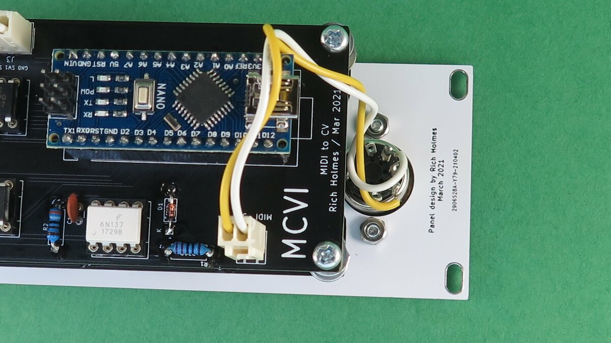

# MCVI Build Notes

This is a pretty straightforward build. I recommend socketing the Arduino Nano using two 15-position pin sockets. 

There are two PCBs, the main one and the jacks/LEDs board. They connect electrically via a 10-position pin header/socket pair and mechanically via M3 spacers and screws. 

As usual, place the jacks and LEDs on their board without soldering them, then mount the front panel, then solder the jacks and LEDs.

For the pin headers I used, the board separation is about 11 mm, so I used 10 mm spacers and a couple of washers. Connect the boards without soldering the pin header and socket, then solder them. See photo.

 

The MIDI jack and the switch are mounted to the front panel. You can solder their wires directly to the main PCB, or use Molex connectors/headers for easier disassembly when debugging. The notch at the top of the main circuit board can be used to help route the switch wires.

When looking at the panel from the back:

* The leftmost switch wire goes to the topmost hole (labeled SW3)
* The middle switch wire goes to the bottommost hole (labeled GND)
* The rightmost switch wire goes to the middle hole (labeled SW1)
* The pin immediately left of the bottom center pin on the MIDI jack connects to the topmost hole (labeled 4)
* The pin immediately right of the bottom center pin on the MIDI jack connects to the bottommost hole (labeled 5)
* The remaining MIDI jack pins are not connected.

See photos.

 
 

*Mea culpa* for using a white wire for ground!